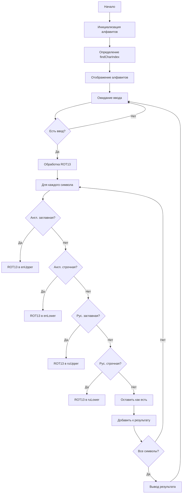

```mermaid
flowchart TD
    A[Начало] --> B[Инициализация алфавитов]
    B --> C[Определение findCharIndex]
    C --> D[Отображение алфавитов]
    D --> E[Ожидание ввода]
    E --> F{Есть ввод?}
    F --> |Да| G[Обработка ROT13]
    F --> |Нет| E
    G --> H[Для каждого символа]
    H --> I{Англ. заглавная?}
    I --> |Да| J[ROT13 в enUpper]
    I --> |Нет| K{Англ. строчная?}
    K --> |Да| L[ROT13 в enLower]
    K --> |Нет| M{Рус. заглавная?}
    M --> |Да| N[ROT13 в ruUpper]
    M --> |Нет| O{Рус. строчная?}
    O --> |Да| P[ROT13 в ruLower]
    O --> |Нет| Q[Оставить как есть]
    Q --> R[Добавить к результату]
    R --> S{Все символы?}
    S --> |Нет| H
    S --> |Да| T[Вывод результата]
    T --> E
```
